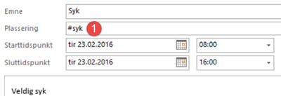

Du kan også holde oversikt over ikke fakturerbare avtaler i Mertid.

Du benytter samme metode som for fakturerbare, men du trenger kun å fylle ut feltet _plassering med riktig kode:

*(men det er mer informativt om du også fyller ut emne-feltet)*

## Gyldige koder
Listen over gyldige koder finner du på dashboardet ditt,
eller i menyen:

| Menyvalg      | Rettighet           |
|---------------|---------------------|
| {{page.menu}} | {{page.permission}} |

*Dersom du har rettigheter til det.*

Som standard har vi definert [disse kodene](hashtags) i Mertid.