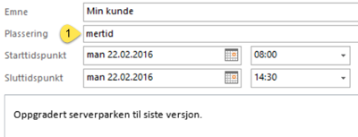

For å benytte kalenderen din som timeregistrering trenger du kun å følge tre enkle punkter:

1. Skriv inn kunde-/kontraktnavn i Emnefeltet

2. Legg til koden _mertid_ i feltet plassering på avtalen

3. Beskriv hva som er utført i selve avtaleteksten

Se [denne linken](ikke_fakturerbare)

Se [denne linken](ikke_fakturerbare.md) for hvordan du skal føre timer som ikke skal faktureres

