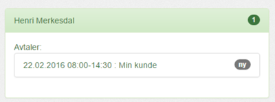

For å benytte kalenderen din som timeregistrering trenger du kun å følge tre enkle punkter:

1. Legg til koden _mertid_ i feltet plassering på avtalen:

2. Skriv inn kundenavn i Emnefeltet:

!

3. 

Mertid vil selv finne ut om dette er en ny eller endret avtale og vil vise alle endringer:

plved bli til en avtlae i MErtid når du har ført rett kode på rett sted.
Somu tSe videoen hvordan føre avtaler i Mertid baserer seg på at man benytter kalenderen til å holde orden 

