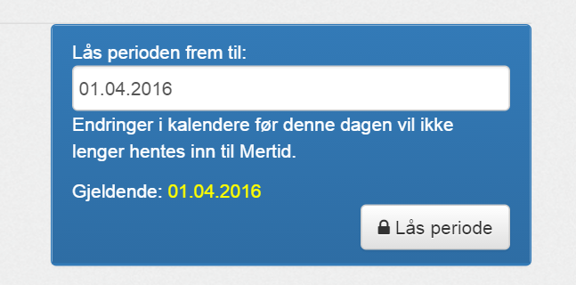

Etter endt periode(måned)og evt. ordrebehandling bør perioden låses.
Når en periode er låst vil avtaler før denne datoen ikke hentes og oppdateres lenger. 

Denne innstillingen overstyrer [Antall dager](hentavtaler) og jobber sammen med den innstillingen slik at man f.eks henter siste 32 dager for å hente hele måneden,
men setter perioden låst frem til den 1. i inneværende måned.

Mertid vil da gjennom hele måneden kun hente fra låsingsdato (1. i måneden) og frem til dagens dato.

Gå til:

| Menyvalg      | Rettighet           |
|---------------|---------------------|
| {{page.menu}} | {{page.permission}} |

*Dersom du har rettigheter til det.*

Velg dato og trykk Lås periode

##Låse opp perioden igjen##

Dersom du har behov for å hente avtaler tilbake før låst periode så er det mulig.
Det kan f.eks være for å hente inn oppdaterte avtaler etter fakturering fordi en konsulent hadde glemt en timeføring.

Du står fritt til å endre Låse periode lenger tilbake i tid og så trykke Lås periode på nytt.
Du bør da hente oppdatere avtaler og så sette Låseperioden tilbake til korrekt verdi. 
