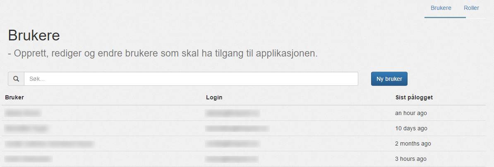
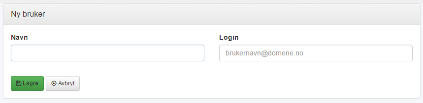
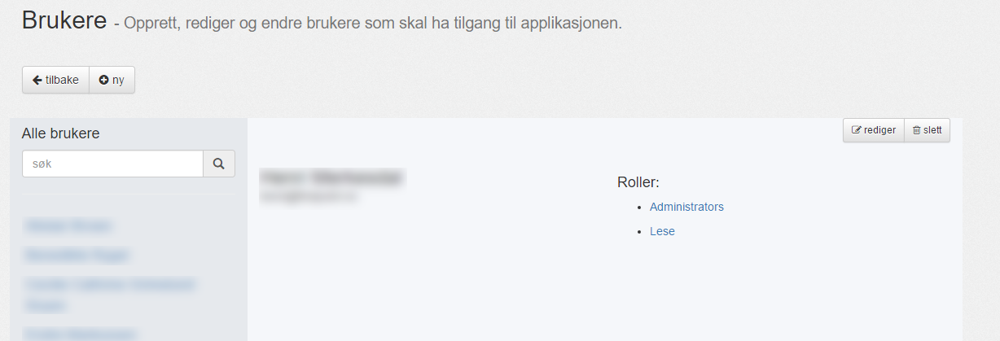
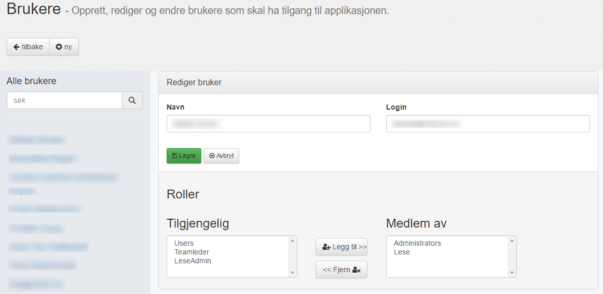

#### Oversikt 

Her er oversikten over alle brukere for applikasjonen.

| Menyvalg      | Rettighet           |
|---------------|---------------------|
| {{page.menu}} | {{page.permission}} |

Brukere er brukerkontoer for Mertid. Forskjell fra [konsulenter]():

 - En bruker kan logge inn i Mertid.
 - Konsulenter har en kalender vi henter timer fra.
 - En konsulent kan også være en bruker og vil da få opp sitt [personlige dashboard](../../introduksjon/dashboard).
 - En bruker kan være en konsulent, en konsulentleder eller en administrator og har forskjellige rettigheter basert på hvilke [roller](roller) han tilhører.

Brukere har to felt: __Navn__ og __Login__.

| Navn         | Login                    |
|--------------|--------------------------|
| Kari Nordmann | kari.nordmann@domene.no |

Søkefeltet filtrerer brukere basert disse to feltene.

---------

#### Ny Bruker

For å legge til en ny bruker trykker du på "__Ny bruker__" fra oversikten.

Fyll så inn navn og login informasjon og trykk "__Lagre__".

---------

#### Detaljer om bruker

Velg en bruker fra oversikten, trykk på brukeren.

Du får da oversikt over __Navn__, __Login__ og brukerens __[Roller](roller)__, som er adgangsnivået i Mertid.

---------

#### Rediger bruker

Trykker man på rediger kan man redigere __Navn__, __Login__ og __Roller__:

Se [denne linken]() for hvordan du kobler sammen en konsulent og en bruker.

