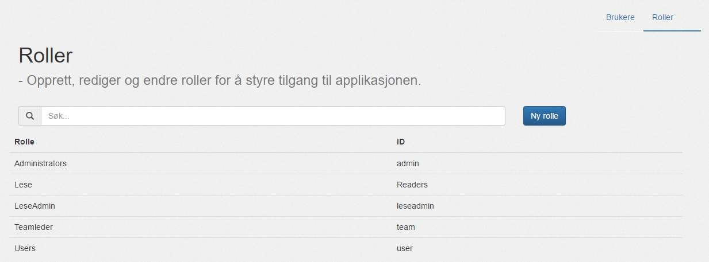
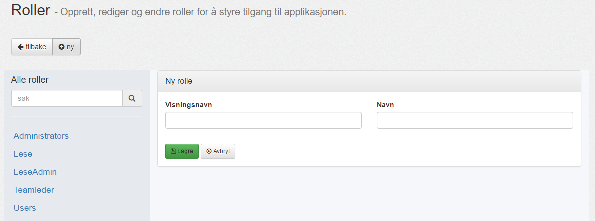
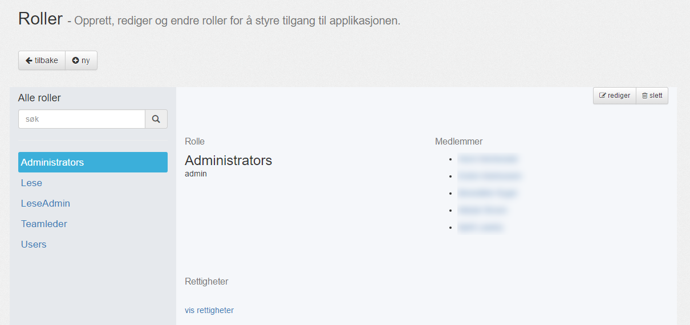
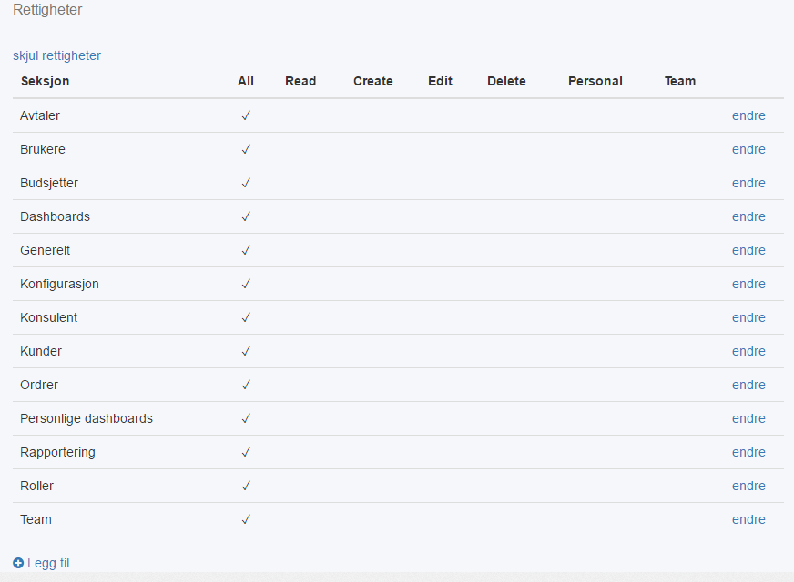
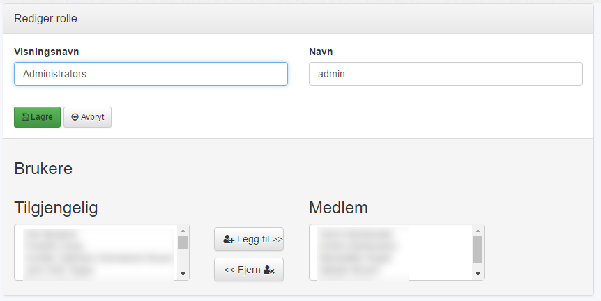

#### Oversikt

Her er oversikten over alle roller i applikasjonen.

| Menyvalg      | Rettighet           |
|---------------|---------------------|
| {{page.menu}} | {{page.permission}} |

Søkefeltet filtrerer rollene basert på __Rolle (Visningsnavn)__ og __ID (Navn)__. 

--------

#### Ny rolle

Fra oversikten kan du velge "__Ny rolle__":

--------

#### Rolle detaljer

Velger du en rolle fra oversikten, kommer du til detaljert visning:

Her ser du visningsnavnet, the interne navnet og [brukere](brukere) som ligger under denne rollen.

Du kan også redigere rettigheter herfra, via "__vis rettigheter__":

--------

#### Rediger rolle

For å redigere visningsnavn, navn og [brukere](brukere) under denne rollen, trykk på "__Rediger__":

Se [denne linken]() for hvordan du kobler sammen en konsulent og en bruker.

