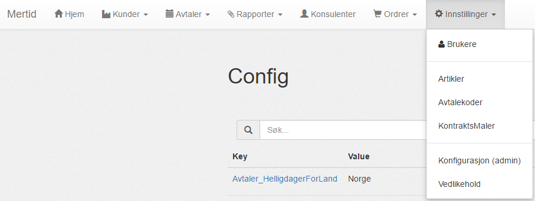

- Brukere
	- [Brukere](brukere/brukere)
	- [Roller](brukere/roller)
- [Artikler](artikler)
- Avtalekoder
- KontraktsMaler
- Konfigurasjon
	- [Hent avtaler for X antall dager](konfigurasjon/antall_dager)
	- [Endre grenseverdier for arbeidsdager](konfigurasjon/arbeidsdag_grenseverdier)
	- [Sett oppdeling av en arbeidstime](konfigurasjon/time_inndeling)
    - [Sett time inndelingen](konfigurasjon/time_inndeling)
    - [Velg beregnet helligdager basert på land](konfigurasjon/helligdager_land)
- Vedlikehold