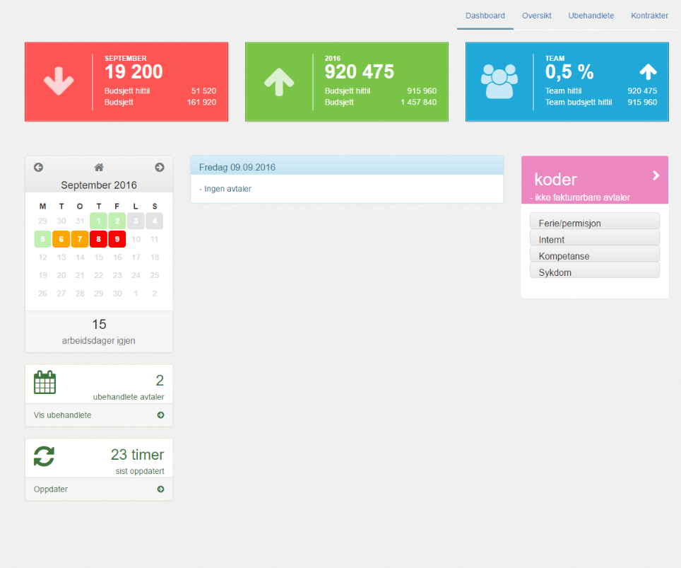
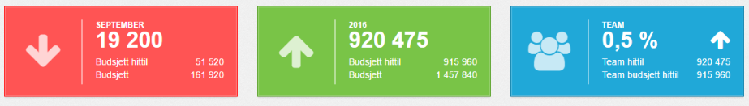
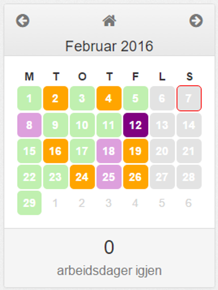

[comment]: Resize bilder - http://stackoverflow.com/a/14747656

Dashboardet er laget for å kjappest mulig gi deg oversikt over din status.

---------

#### Resultat mot budsjett

Mertid viser hvordan du ligger an i forhold til ditt budsjett for denne måneden, for året som helhet og for hele Teamet.

Vi tar hensyn til hvor langt du er kommet i måneden og året, og vil indikere om du ligger foran eller bak budsjett basert på hvor mange arbeidsdager som er gått og hvor mye du har fakturert. 

Rødt og pil ned indikerer at du ligger bak budsjettet.

Grønt og pil opp indikerer at du ligger foran budsjett.

I tillegg til dine tall vises det hvordan teamet ditt som helhet presterer, med pil opp for foran og pil ned for bak budsjett.

Det samme kan leses ut av tallene direkte.

----------

#### Kalender
Kalenderen viser avtaler registrert i Mertid, og indikerer med fargekoder om du har ført tilstrekkelig antall timer for hver dag. 
(Hvis du mangler noen avtaler kan du selv hente inn dine avtaler ved å trykke på ruten Oppdater.)

Vi benytter følgende fargekoder:

 - Grønn: Du har registret nok timer den dagen.
 - Oransje: Du har litt for få registerte timer den dagen.
 - Rød: Du har ingen/nesten ingen timer registert den dagen.
 - Lys lilla: Du har ganske mange timer registrert den dagen (sjekk evt dobbeltføring og overtidsbestemmelser)
 - Mørk lilla: Du har veldig mange timer registrert den dagen (sjekk om en eller flere avtaler er ført feil, og pass på at du overholder overtidsbestemmelsene)
 - Rød sirkel: Dette er en helligdag.

##### Se på avtaler for en dag
Trykk på dagen du vil vite mer om for å se hvilke avtaler som  som er registrert på deg. Merk at avtaler som ikke er matchet en kontrakt  eller en ikke-fakturerbar kode ikke vil telle med i antall timer ført den dagen. Tilsvarende vil avtaler som har feil kode heller ikke komme inn og vises. Det svarer seg derfor og sjekke alle oransje og røde dager mot din kalender for å se at du har fått hentet inn alle dine avtaler. 
Når du har gjort eventuelle justeringer i din kalender kan du trykke Oppdater i Mertid og vi vil hente inn dine siste endringer.

Se [denne linken](../avtaler/avtaler) for hvordan du skal føre timer, eller [denne linken](../avtaler/ikke_fakturerbare) for hvordan du skal føre ikke-fakturerbare timer.
 
Konsulentledere kan justere grenseverdiene for fargeindikatorene, se [denne linken](../innstillinger/konfigurasjon/arbeidsdag_grenseverdier).

