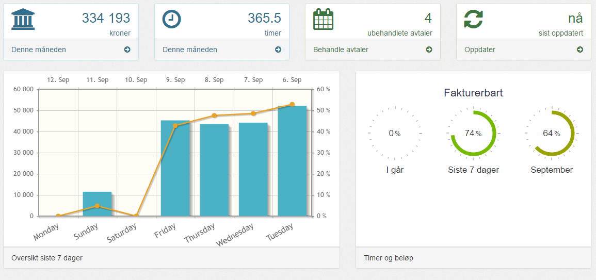
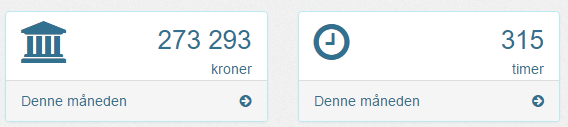
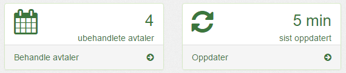
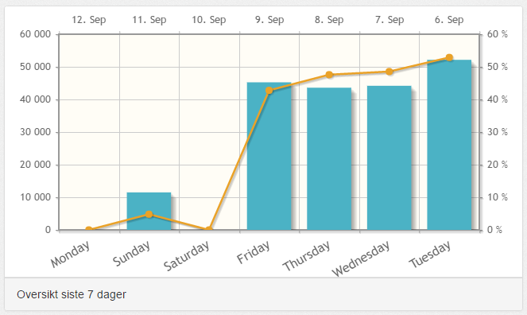
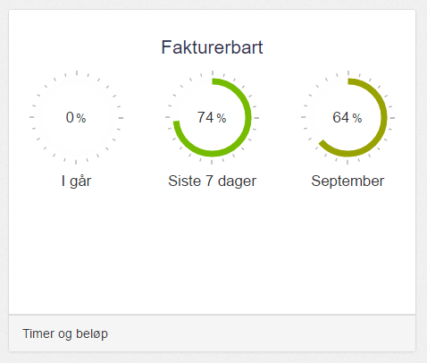
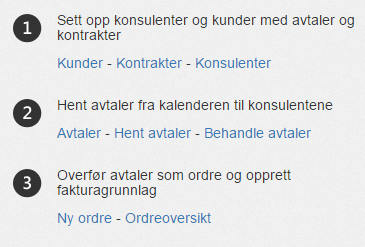

Dette er hoveddashboardet som vises når du logger inn som konsulentleder. Dashboardet er ment å gi en kjapp oversikt over status for de viktigste tallene i perioden.

| Menyvalg      | Rettighet           |
|---------------|---------------------|
| {{page.menu}} | {{page.permission}} |

---------

#### Resultat

Mertid viser nåværende resultat og antall fakturerbare timer denne måneden.

Trykk på en av rutene for å få [detaljert oversikt]() over måneden.

----------

#### Oversikt avtaler

Den første ruten, viser ubehandlede avtaler som ikke er matchet mot en kunde.  Trykk på ruten for å matche [ubehandlete avtaler]().

Den andre ruten forteller deg når du sist hentet inn avtaler. Trykker man på den vil man starte [henting av nye avtaler]() fra konsulentenes kalender.

---------

#### Ukesoversikt

Her viser Mertid en oversikt over utfaktureringsgrad og beløp de siste syv dagene.

De blå søylene er inntjent beløp, mens den gule linjen er faktureringsgrad de siste dagene.

Se [Avtaler - Oversikt](../avtaler/avtaler), for en oversikt over antall timer per konsulent og kunde. 
 
Du kan også se [oppfølging av fakturagrunnlaget]().

---------

#### Fakturerbare avtaler oversikt

Mertid viser prosentsats av avtaler som er fakturerbare.

Se [Avtaler - Oversikt](../avtaler/avtaler), for en oversikt over antall timer per konsulent og kunde. 
 
Du kan også se [oppfølging av fakturagrunnlaget]().

---------

