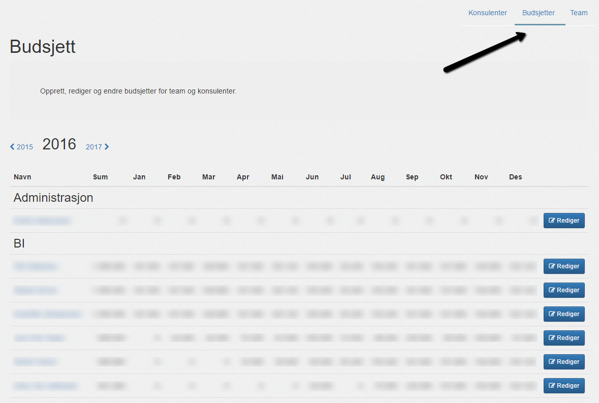
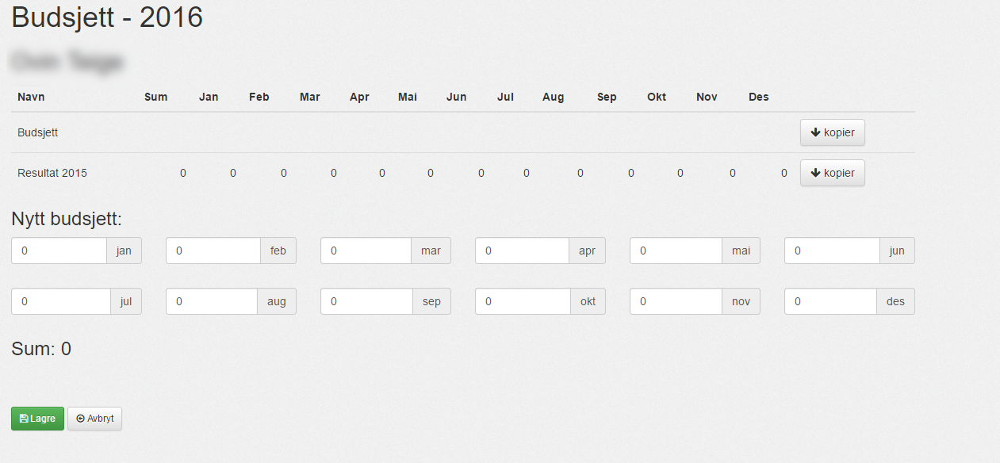
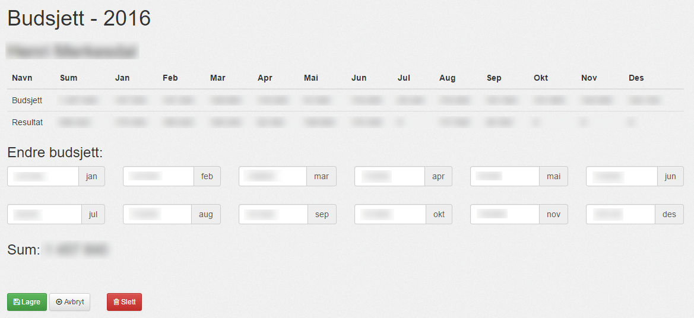

#### Oversikt

Her får du oversikt over budsjetter for [konsulenter](konsulenter) og [teams](teams).

Oversikten gjelder år for år, med månedsbudsjett og totalsum.

--------

#### Opprett budsjett

Hvis det ikke er lagt inn budsjett på konsulenten, kan du opprette et ved å velge "__Opprett__".

Her har man mulighet til å kopiere budsjettet fra forrige år, om tilgjengelig. Ellers må det tastes inn på månedsbasis.

--------

#### Rediger budsjett

Hvis et budsjett er satt opp for gjeldende år, men skal korrigeres, velg "__Rediger__" fra oversikten.

Kan da redigere budsjettet på månedsbasis.