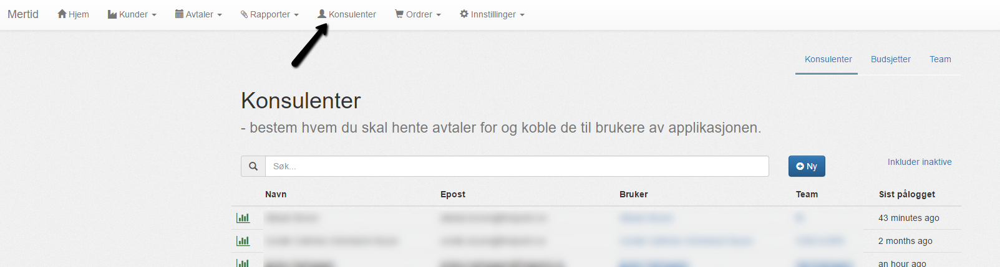
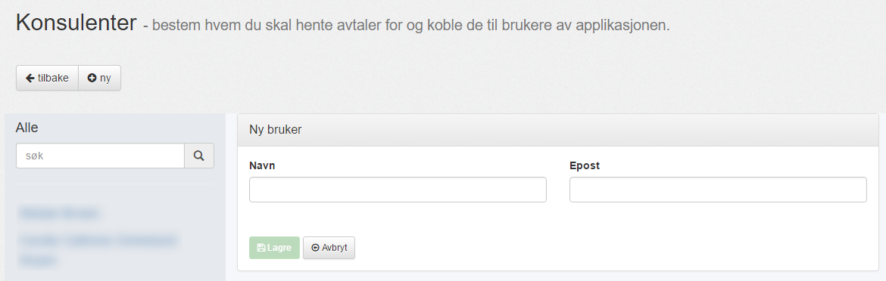
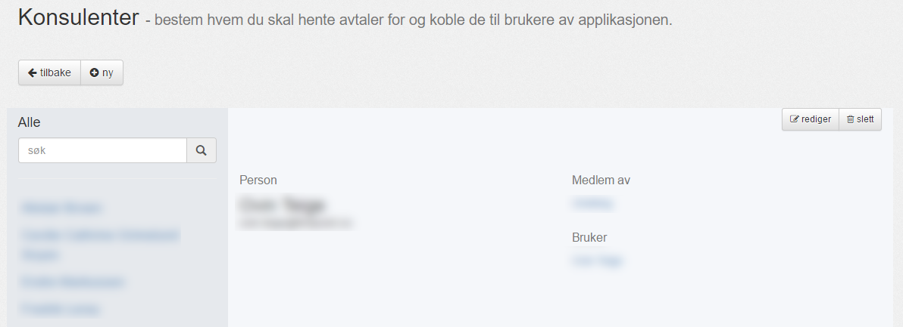
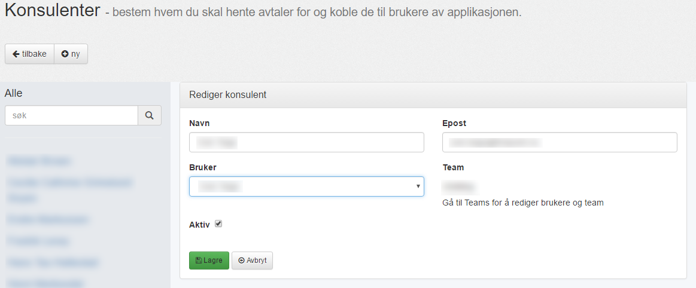

#### Oversikt

Her vises oversikten av registrerte konsulenter.

| Menyvalg      | Rettighet           |
|---------------|---------------------|
| {{page.menu}} | {{page.permission}} |

Konsulenter vs [Brukere](../innstillinger/brukere/brukere):

 - En bruker kan logge inn i Mertid.
 - Konsulenter har en kalender vi henter timer fra.
 - En konsulent kan også være en bruker og vil da få opp sitt [personlige dashboard](../introduksjon/dashboard).
 - En bruker kan være en konsulent, en konsulentleder eller en administrator og har forskjellige rettigheter basert på hvilke [roller](../innstillinger/brukere/roller) han tilhører.

---------

#### Ny konsulent

Du kan lage en ny konsulent ved å trykke på "__Ny__" i oversikten:

Legg inn ønsket navn og epost. For å koble konsulenten opp mot en bruker, scroll ned til "__Rediger konsulent__" på denne siden.

--------

#### Konsulent detaljer

Når du har valgt en konsulent fra oversikten, eller laget en ny konsulent, kommer du til denne siden:

Fra denne siden kan du velge å lage en __Ny__ konsulent, __Redigere__ eller __Slette__ valgt konsulent

Her ser du konsulentens __Navn__ og __Epost__, samt hvilket __[Team](teams)__ konsulenten er med i og hvilken __[Bruker](../innstillinger/brukere/brukere)__ konsulenten er koblet opp mot.

-------

#### Rediger Konsulent

Velg "__Rediger__" fra detalje oversikten:

Her kan du velge nytt __Navn__, __Epost__ og __Bruker__, samt. velge om konsulenten er __Aktiv__ eller ei.

For å endre __Team__ tilknyttning, må du inn på __[Team](teams)__ visningen.

En [Bruker](../innstillinger/brukere/brukere) må eksistere før man kan knytte den til en konsulent.
Benytt gjerne samme navn og epost.

