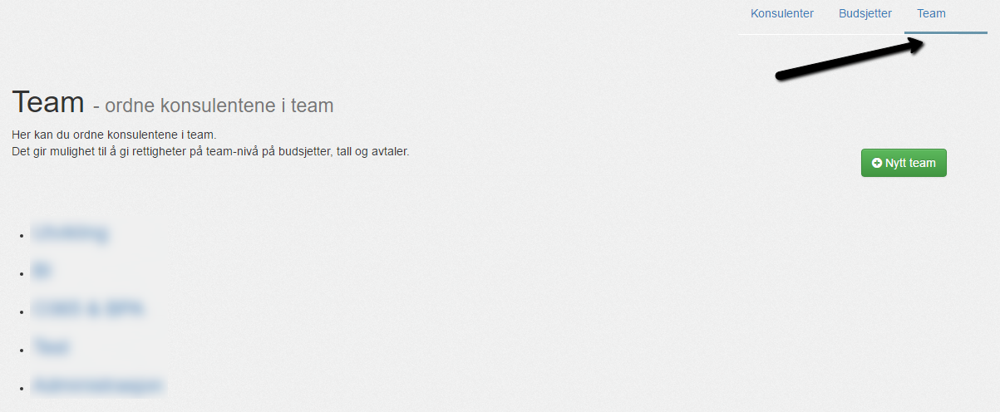
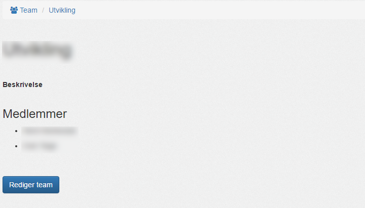
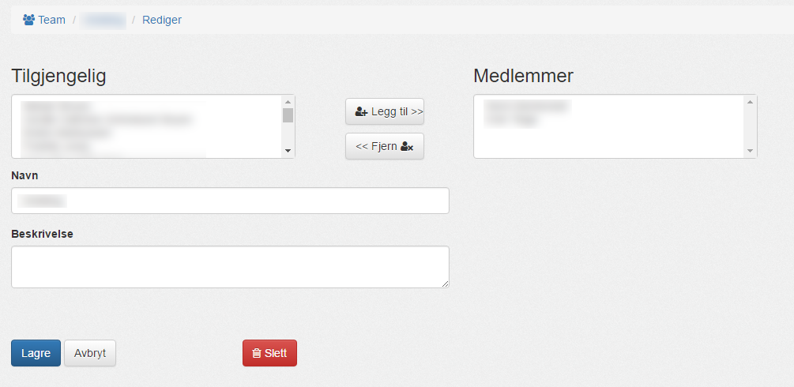

#### Oversikt

Her finner du oversikten over alle konsulent teams.

Et team er en samling av konsulenter. Konsulenter i team kan få team-nivå rettigheter på [budsjetter](budsjetter), tall og [avtaler](../avtaler/).

---------

#### Nytt team

Fra oversikten, velg "__Nytt Team__":

Her kan du velge navnet på teamet.
Når du lagrer, får du __detaljert visning__ av det nye teamet.

---------

#### Detaljert visning av team

Når du velger et team fra oversikten, eller lager et nytt team, kommer du til detaljert visning av teamet:

Her vises __Navnet__, __Beskrivelse__ og __Konsulenter__.

For å redigere eller slette teamet, velg "__Rediger team__".

--------

#### Rediger team

Her kan du skifte navn og beskrivelse for teamet, samt. legge til og fjerne konsulenter.

Eller velge å slette teamet.