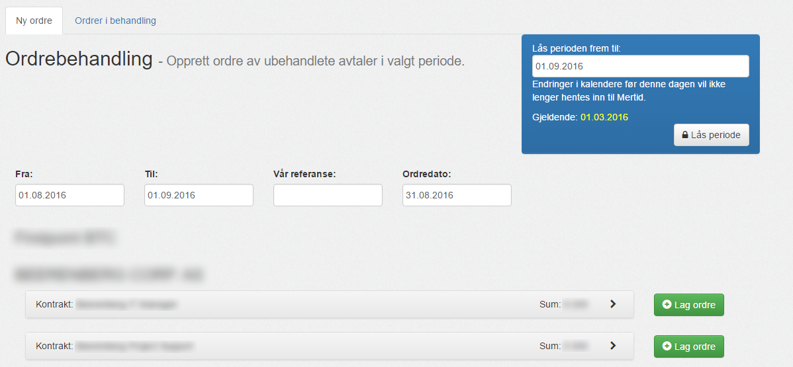

#### Oversikt

Her får du oversikt over kontrakter mot kunder, basert på ubehandlete avtaler.

| Menyvalg      | Rettighet           |
|---------------|---------------------|
| {{page.menu}} | {{page.permission}} |

Kontraktene blir vist basert på intervallet du har valgt mellom datoene i __Fra__ og __Til__.

Summen er ubehandlete avtaler basert på kontraktens satser i den valgte perioden.

Avtalene er hentet fra konsulentene i den valgte perioden.

NB! Endringer før den låste datoen vil ikke bli hentet inn i Mertid.
 
Les mer om [låsing av perioden](periode).

--------

#### Ny ordre

Du kan opprette en ny ordre ved å klippe på "__Lag ordre__" ved siden av kontrakten fra oversikten.

>BILDE

>INFO
